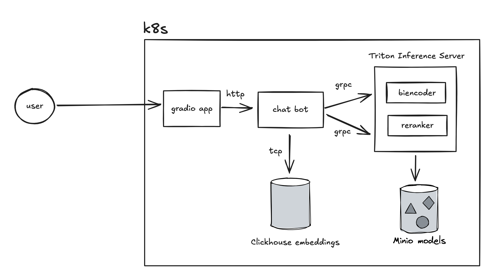

# House MD Chat Bot - Retrieval Task Example

This project demonstrates a practical implementation of a retrieval task in Natural Language Processing (NLP) as part of the Generative NLP course. It creates a chat bot that responds with relevant quotes from the TV show House MD using a two-stage retrieval and reranking approach.


## Architecture Overview



The system uses a bi-encoder for initial retrieval and a cross-encoder for reranking, following modern information retrieval practices:

1. Initial Retrieval: Uses a fine-tuned bi-encoder (`sentence-transformers/all-MiniLM-L6-v2`) to find candidate responses
2. Reranking: Applies a cross-encoder (`cross-encoder/ms-marco-MiniLM-L-6-v2`) to rerank candidates
3. Vector Storage: Utilizes ClickHouse for efficient vector similarity search
4. Model Serving: Deploys models using NVIDIA Triton Inference Server

## Components

### 1. BiEncoder Training

The bi-encoder was fine-tuned on the House MD transcripts dataset using triplet loss. The model was trained for 3 epochs with a batch size of 16 and a learning rate of 2e-5.

- Training code can be found in [notebooks/train_biencoder.ipynb](notebooks/train_biencoder.ipynb)
- WB report for the training process can be found [here](https://api.wandb.ai/links/vkrnsno/6r91jtbq)

### 2. Backend Service

The main service handles:
- Vector similarity search in ClickHouse
- Communication with Triton Inference Server
- Response reranking

## Infrastructure

### ClickHouse Setup

- Deployed as StatefulSet in Kubernetes
- 10GB persistent storage
- Configured for vector similarity search

### Triton Inference Server

- Serves both bi-encoder and reranker models
- Configured for dynamic batching
- Models stored in MinIO

Configuration example:

```
name: "biencoder"
platform: "pytorch_libtorch"
max_batch_size: 8

input [
  {
    name: "input_ids"
    data_type: TYPE_INT64
    dims: [ -1 ]  # Dynamic sequence length
  },
  {
    name: "attention_mask"
    data_type: TYPE_INT64
    dims: [ -1 ]  # Dynamic sequence length
  }
]

output [
  {
    name: "output"
    data_type: TYPE_FP32
    dims: [ -1, 384 ]  # Dynamic sequence length, embedding size
  }
]

instance_group [
  {
    count: 1
    kind: KIND_CPU
  }
]

dynamic_batching {
  preferred_batch_size: [ 1, 4, 8 ]
  max_queue_delay_microseconds: 100
}
```

## Getting Started

1. Deploy infrastructure:
    - ClickHouse
    - MinIO. Upload the models in TorchScript format with descriptors to the `models` bucket
    - Triton Inference Server
2. Deploy the backend service
3. Load embeddings into ClickHouse using the [job.yaml](k8s/chat-bot/job.yaml) job
4. Deploy the frontend service

## Course Context

This assignment demonstrates key concepts in modern NLP retrieval systems:
- Dense vector retrieval
- Two-stage retrieval architecture
- Model serving at scale
- Vector database usage
- Containerized ML deployment

## Technologies Used

- PyTorch & Lightning
- Sentence Transformers
- NVIDIA Triton Inference Server
- ClickHouse
- Kubernetes
- MinIO
- Gradio

## Licence

MIT
