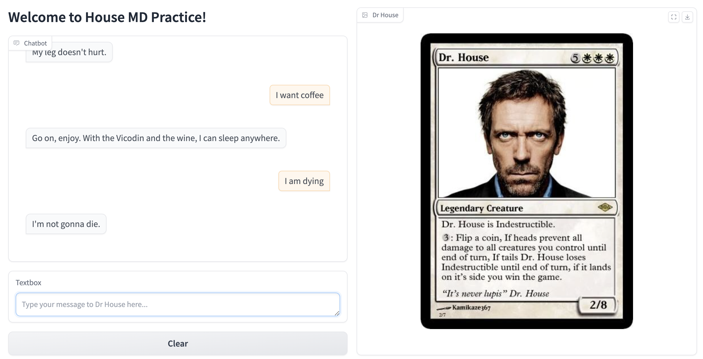

# Chat Bot
This is a simple chat bot based on `sentence-transformers/all-MiniLM-L6-v2` model fine-tuned on `kunalbhar/house-md-transcripts` which serves as a BiEncoder and `cross-encoder/ms-marco-MiniLM-L-6-v2` as a CrossEncoder.

Live demo: [link](http://34.30.156.210/)

## Architecture

## Fine-tuning BiEncoder
The model was fine-tuned on the `kunalbhar/house-md-transcripts` dataset using the `sentence-transformers` library. The model was trained for 3 epochs with a batch size of 16 and a learning rate of 2e-5.
WB Report: [link](https://api.wandb.ai/links/vkrnsno/6r91jtbq)

## Loading embeddings into ClickHouse
The embeddings were calculated in [notebooks/train_biencoder.ipynb](notebooks/train_biencoder.ipynb), saved as an [scripts/embeddings.npy](scripts/embeddings.npy) file and pre-loaded into ClickHouse using the [chat-bot/job.yaml](k8s/chat-bot/job.yaml) job.

## Minio
Models:
 - [BiEncoder](https://huggingface.co/sentence-transformers/all-MiniLM-L6-v2)
 - [CrossEncoder](https://huggingface.co/cross-encoder/ms-marco-MiniLM-L-6-v2)

The fine-tuned biencoder and reranker exported in TorchScript format and stored in Minio.

## Triton Inference Server
The fine-tuned biencoder model and reranker are served using Triton Inference Server. Chat Bot uses the `tritonclient` library to interact with the server via gRPC.
